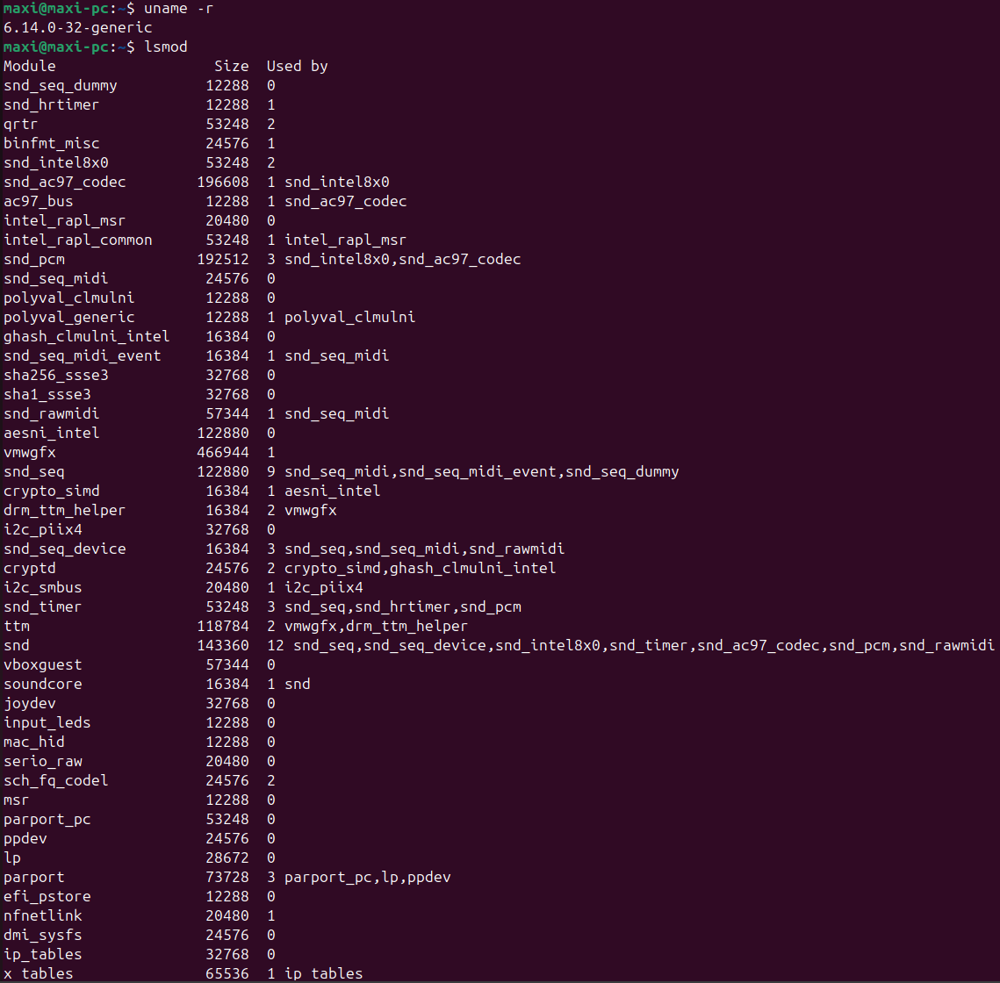
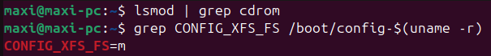
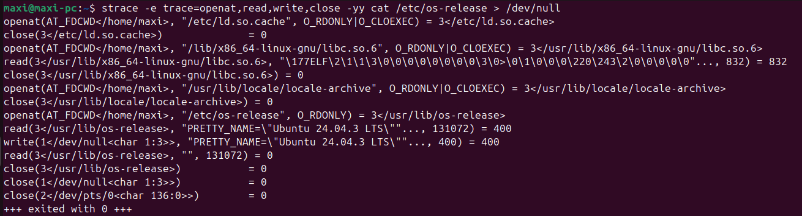
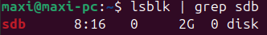
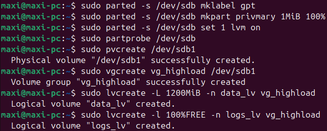
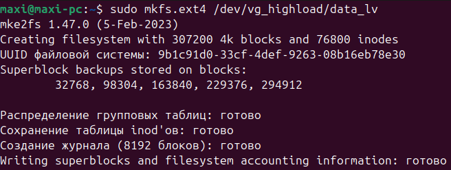
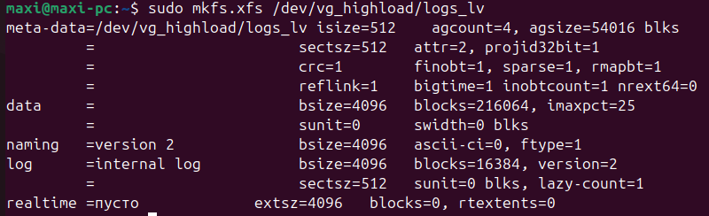
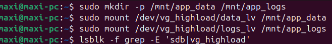
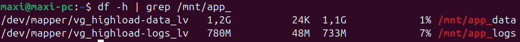
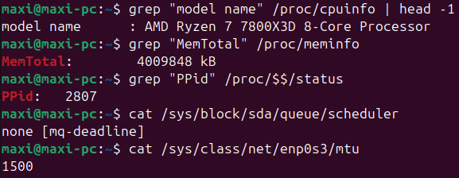

# Домашнее задание №2 (Эксплуатация высоконагруженных систем)

## Задание 1. Kernel and Module Inspection

* продемонстрировать версию ядра ОС
* показать все загруженные модули ядра
* отключить автозагрузку модуля cdrom
* найти и описать конфигурацию ядра (файл конфигурации, параметр CONFIG_XFS_FS)

## Задание 2. Наблюдение за VFS

* проанализировать команду ```cat /etc/os-release > /dev/null``` при помощи strace (для этого запустить ```strace -e trace=openat,read,write,close cat /etc/os-release > /dev/null```)
* описать открываемый и читаемый файл, объяснить отсутствие записывающих вызовов в выводе

## Задание 3. LVM Management

* добавить к своей виртуальной машине диск /dev/sdb размером 2GB
* создать раздел на /dev/sdb, используя fdisk или parted
* создать Physical Volume на этом разделе
* создать Volume Group с именем vg_highload
* создать два Logical Volume: data_lv (1200 MiB) и logs_lv (оставшееся место)
* отформатировать data_lv как ext4 и примонтировать в /mnt/app_data
* отформатировать logs_lv как xfs и примонтировать в /mnt/app_logs

## Задание 4. Использование pseudo filesystem

* извлечь из /proc модель CPU и объём памяти (KiB)
* используя /pros/\$\$/status, найдите Parent Process ID текущего shell. Что означает \$\$?
* определить настройки I/O scheduler для основного диска /dev/sda
* определить размер MTU для основного сетевого интерфейса (например, eth0 или ens33)

---

## Выполнение задания 1

Версия ядра (6.14.0-32-generic) и список загруженных модулей представлены на скриншоте ниже.



Модуль cdrom уже не загружен (как видно на скриншоте ниже). Параметр CONFIG_XFS_FS установлен в значение "m" (XFS поддерживается как модуль ядра, а не встроен в ядро).



## Выполнение задания 2



Нет записывающих вызовов в shell, т.к. стандартный вывод перенаправлен в /dev/null.

## Выполнение задания 3

Был создан и примонтирован диск размером 2 гигабайта.



Был создан раздел, созданы PV и VG.









Результат:



## Выполнение задания 4

* Модель процессора: AMD Ryzen 7 7800X3D
* ОЗУ: 4 Гб (выделено виртуальной машине)
* PPid для shell: 2807. $$ - это process id для shell
* Настройки I/O scheduler: none \[md-deadline\]
* Размер MTU для основного сетевого интерфейса: 1500

